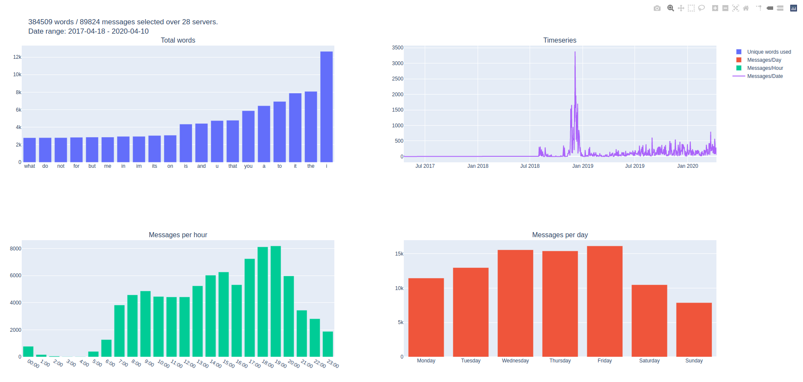
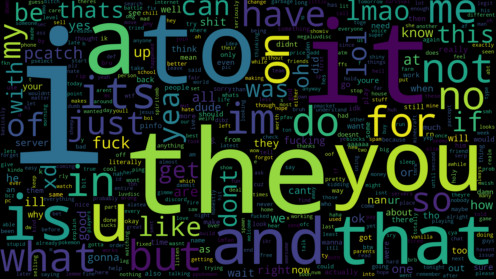

# DiscordData.py
This program takes Discord's data dump and visualizes it using plotly and python3

## Obtaining data
User Settings -> Privacy & Safety -> Request all of my Data

Extract the zip into a folder.

## Running
```bash
chmod 755 ./discordwords.py
./discordwords.py /path/to/discord/data/
```

### Dependencies
* Plotly
* Pandas
* Wordcloud + matplotlib (Only if using wordcloud option)


### Example commands

#### Plot the dashboard
```bash
./discordwords.py /path/to/discord/data/ -d
```

#### Plot a word cloud
```bash
./discordwords.py /path/to/discord/data/ -c
```

#### Plot a wordcloud of messages between Jan 01 2018 and Jan 01 2019
```bash
./discordwords.py /path/to/discord/data/ -c -s 2018-01-01 -e 2019-01-01
```

## Example output
Dashboard:



Word Cloud:




## TODO:
~~Implement datetime selector~~

Implement some sort of server-specific view for messages
